# Clario Database Schema

Complete database documentation for the Clario Forensic Fingerprint Analysis Platform.

## Overview

The database is built on **PostgreSQL** with **SQLAlchemy ORM** (async support via asyncpg). The schema supports forensic fingerprint analysis with full audit trails, FBI/NCIC classification standards, and chain-of-custody compliance.

## Entity Relationship Diagram

```mermaid
erDiagram
    USERS ||--o{ CASES : creates
    USERS ||--o{ FINGERPRINTS : uploads
    USERS ||--o{ AUDIT_LOGS : generates

    CASES ||--o{ EXHIBITS : contains
    EXHIBITS ||--o{ FINGERPRINTS : contains
    FINGERPRINTS ||--o{ PROCESSING_RESULTS : has

    PIPELINE_CONFIGS ||--o{ PROCESSING_RESULTS : uses
    PIPELINE_VERSIONS ||--o{ PROCESSING_RESULTS : tracks

    USERS {
        uuid id PK
        string email UK
        string username UK
        string hashed_password
        string full_name
        enum role
        string agency
        boolean is_active
        datetime created_at
        datetime updated_at
        datetime last_login
        enum auth_provider
        string google_id UK
        string profile_picture
    }

    CASES {
        uuid id PK
        string case_number UK
        string title
        text description
        string agency
        enum source_type
        enum status
        uuid operator_id FK
        datetime created_at
        datetime updated_at
        string external_reference
        text notes
    }

    EXHIBITS {
        uuid id PK
        string exhibit_number
        text description
        string location_collected
        datetime collection_date
        string collector_name
        uuid case_id FK
        integer sequence_order
        datetime created_at
        datetime updated_at
    }

    FINGERPRINTS {
        uuid id PK
        string original_filename
        string original_storage_path
        string original_hash_sha256
        integer file_size_bytes
        string mime_type
        integer image_width
        integer image_height
        integer dpi
        enum evidence_type
        enum print_type
        enum finger_position
        enum detail_level
        enum status
        text processing_error
        float quality_score
        json quality_issues
        enum pattern_type
        enum pattern_subtype
        float pattern_confidence
        text classification_rationale
        string ncic_code
        integer henry_value
        integer ridge_count
        integer core_count
        integer delta_count
        json core_positions
        json delta_positions
        integer minutiae_count
        json minutiae_details
        string ridge_flow_direction
        float ridge_density
        text examiner_notes
        boolean manual_override
        boolean multiple_fingerprints
        uuid exhibit_id FK
        uuid uploaded_by_id FK
        datetime created_at
        datetime updated_at
        datetime processed_at
    }

    PROCESSING_RESULTS {
        uuid id PK
        uuid fingerprint_id FK
        string enhanced_storage_path
        string enhanced_hash_sha256
        string pipeline_version
        json pipeline_config
        string enhancement_preset
        string model_name
        string model_version
        float quality_score_before
        float quality_score_after
        float quality_improvement
        integer processing_time_ms
        string artifact_risk_level
        json artifact_warnings
        string ridge_orientation_map_path
        string rationale_overlay_path
        boolean is_primary
        datetime created_at
    }

    PIPELINE_CONFIGS {
        uuid id PK
        string name UK
        string display_name
        text description
        json config
        boolean is_default
        boolean is_active
        string artifact_risk_level
        string version
        datetime created_at
        datetime updated_at
    }

    PIPELINE_VERSIONS {
        uuid id PK
        string version UK
        text description
        string git_commit_hash
        json steps
        string gemini_model
        string prompt_template_hash
        boolean is_current
        boolean is_deprecated
        datetime created_at
        datetime deprecated_at
    }

    AUDIT_LOGS {
        uuid id PK
        uuid user_id FK
        string username
        enum action
        string resource_type
        string resource_id
        json details
        json old_value
        json new_value
        string ip_address
        string user_agent
        string success
        text error_message
        datetime created_at
    }
```



---

## Table Definitions

### users

Stores user accounts with authentication and role information.

| Column | Type | Constraints | Default | Description |
|--------|------|-------------|---------|-------------|
| `id` | UUID | PRIMARY KEY | `uuid4()` | Unique identifier |
| `email` | VARCHAR | UNIQUE, NOT NULL | - | User email address |
| `username` | VARCHAR | UNIQUE, NOT NULL | - | Login username |
| `hashed_password` | VARCHAR | NULLABLE | - | Bcrypt password hash (null for OAuth-only) |
| `full_name` | VARCHAR | NULLABLE | - | User's display name |
| `role` | ENUM | NOT NULL | `readonly` | User role |
| `agency` | VARCHAR | NULLABLE | - | Associated organization |
| `is_active` | BOOLEAN | NOT NULL | `true` | Account active status |
| `created_at` | TIMESTAMP | NOT NULL | `now()` | Account creation time |
| `updated_at` | TIMESTAMP | NOT NULL | `now()` | Last modification time |
| `last_login` | TIMESTAMP | NULLABLE | - | Last successful login |
| `auth_provider` | ENUM | NOT NULL | `local` | Authentication method |
| `google_id` | VARCHAR | UNIQUE, NULLABLE | - | Google OAuth user ID |
| `profile_picture` | VARCHAR | NULLABLE | - | Profile picture URL |

**Indexes:**
- `users_pkey` - Primary key on `id`
- `ix_users_email` - Unique index on `email`
- `ix_users_username` - Unique index on `username`
- `ix_users_google_id` - Unique index on `google_id`

**Enums:**
- `UserRole`: `admin`, `examiner`, `technician`, `readonly`
- `AuthProvider`: `local`, `google`

---

### cases

Investigation case records with metadata and status tracking.

| Column | Type | Constraints | Default | Description |
|--------|------|-------------|---------|-------------|
| `id` | UUID | PRIMARY KEY | `uuid4()` | Unique identifier |
| `case_number` | VARCHAR | UNIQUE, NOT NULL | - | Case reference number |
| `title` | VARCHAR | NOT NULL | - | Case title |
| `description` | TEXT | NULLABLE | - | Detailed description |
| `agency` | VARCHAR | NULLABLE | - | Handling agency |
| `source_type` | ENUM | NOT NULL | `other` | Evidence source |
| `status` | ENUM | NOT NULL | `open` | Case status |
| `operator_id` | UUID | FK, NOT NULL | - | Creating user |
| `created_at` | TIMESTAMP | NOT NULL | `now()` | Creation time |
| `updated_at` | TIMESTAMP | NOT NULL | `now()` | Last modification |
| `external_reference` | VARCHAR | NULLABLE | - | External system ID |
| `notes` | TEXT | NULLABLE | - | General notes |

**Foreign Keys:**
- `operator_id` → `users.id`

**Indexes:**
- `cases_pkey` - Primary key on `id`
- `ix_cases_case_number` - Unique index on `case_number`

**Enums:**
- `CaseStatus`: `open`, `in_progress`, `review`, `closed`, `archived`
- `SourceType`: `crime_scene`, `booking`, `elimination`, `training`, `quality_control`, `other`

---

### exhibits

Evidence containers within cases.

| Column | Type | Constraints | Default | Description |
|--------|------|-------------|---------|-------------|
| `id` | UUID | PRIMARY KEY | `uuid4()` | Unique identifier |
| `exhibit_number` | VARCHAR | NOT NULL | - | Exhibit designation |
| `description` | TEXT | NULLABLE | - | Exhibit description |
| `location_collected` | VARCHAR | NULLABLE | - | Collection location |
| `collection_date` | TIMESTAMP | NULLABLE | - | Collection date/time |
| `collector_name` | VARCHAR | NULLABLE | - | Collector's name |
| `case_id` | UUID | FK, NOT NULL | - | Parent case |
| `sequence_order` | INTEGER | NOT NULL | `0` | Display order |
| `created_at` | TIMESTAMP | NOT NULL | `now()` | Creation time |
| `updated_at` | TIMESTAMP | NOT NULL | `now()` | Last modification |

**Foreign Keys:**
- `case_id` → `cases.id` (CASCADE DELETE)

**Indexes:**
- `exhibits_pkey` - Primary key on `id`

---

### fingerprints

Core fingerprint records with comprehensive forensic classification data.

| Column | Type | Constraints | Default | Description |
|--------|------|-------------|---------|-------------|
| **Identification** |
| `id` | UUID | PRIMARY KEY | `uuid4()` | Unique identifier |
| **Original File Information** |
| `original_filename` | VARCHAR | NOT NULL | - | Upload filename |
| `original_storage_path` | VARCHAR | NOT NULL | - | Storage path |
| `original_hash_sha256` | CHAR(64) | NOT NULL | - | SHA-256 integrity hash |
| `file_size_bytes` | INTEGER | NOT NULL | - | File size |
| `mime_type` | VARCHAR | NOT NULL | - | MIME type |
| `image_width` | INTEGER | NULLABLE | - | Width in pixels |
| `image_height` | INTEGER | NULLABLE | - | Height in pixels |
| `dpi` | INTEGER | NULLABLE | - | Dots per inch |
| **Evidence Classification** |
| `evidence_type` | ENUM | NOT NULL | `unknown` | Latent/patent/plastic |
| `print_type` | ENUM | NOT NULL | `unknown` | How captured |
| `impression_type` | VARCHAR | NULLABLE | - | Additional type info |
| `finger_position` | ENUM | NOT NULL | `unknown` | Which finger |
| `subject_id` | VARCHAR | NULLABLE | - | Anonymous subject ID |
| `detail_level` | ENUM | NULLABLE | - | Analysis depth |
| **Processing Status** |
| `status` | ENUM | NOT NULL | `pending` | Processing status |
| `processing_error` | TEXT | NULLABLE | - | Error message |
| **Quality Assessment** |
| `quality_score` | FLOAT | NULLABLE | - | 0-100 quality score |
| `quality_issues` | JSON | NULLABLE | - | Detected issues |
| **Pattern Classification** |
| `pattern_type` | ENUM | NULLABLE | - | Primary pattern |
| `pattern_subtype` | ENUM | NULLABLE | - | Detailed subtype |
| `pattern_confidence` | FLOAT | NULLABLE | - | 0-1 confidence |
| `classification_rationale` | TEXT | NULLABLE | - | Reasoning |
| **Forensic Codes** |
| `ncic_code` | CHAR(2) | NULLABLE | - | FBI/NCIC code |
| `henry_value` | INTEGER | NULLABLE | - | Henry system value |
| `ridge_count` | INTEGER | NULLABLE | - | Delta to core count |
| **Singular Points** |
| `core_count` | INTEGER | NULLABLE | - | Number of cores |
| `delta_count` | INTEGER | NULLABLE | - | Number of deltas |
| `core_positions` | JSON | NULLABLE | - | Core coordinates |
| `delta_positions` | JSON | NULLABLE | - | Delta coordinates |
| **Minutiae Data** |
| `minutiae_count` | INTEGER | NULLABLE | - | Total minutiae |
| `minutiae_details` | JSON | NULLABLE | - | Breakdown by type |
| **Ridge Characteristics** |
| `ridge_flow_direction` | VARCHAR | NULLABLE | - | Flow direction |
| `ridge_density` | FLOAT | NULLABLE | - | Ridges per mm |
| **Examiner Input** |
| `examiner_notes` | TEXT | NULLABLE | - | Manual notes |
| `manual_override` | BOOLEAN | NOT NULL | `false` | Manually corrected |
| **Detection Flags** |
| `multiple_fingerprints` | BOOLEAN | NOT NULL | `false` | Multiple prints |
| **Relationships** |
| `exhibit_id` | UUID | FK, NOT NULL | - | Parent exhibit |
| `uploaded_by_id` | UUID | FK, NOT NULL | - | Uploading user |
| **Timestamps** |
| `created_at` | TIMESTAMP | NOT NULL | `now()` | Upload time |
| `updated_at` | TIMESTAMP | NOT NULL | `now()` | Last modification |
| `processed_at` | TIMESTAMP | NULLABLE | - | Processing completion |

**Foreign Keys:**
- `exhibit_id` → `exhibits.id` (CASCADE DELETE)
- `uploaded_by_id` → `users.id`

**Indexes:**
- `fingerprints_pkey` - Primary key on `id`

**Enums:**
- `EvidenceType`: `latent`, `patent`, `plastic`, `unknown`
- `PrintType`: `rolled`, `plain`, `slap`, `latent_lift`, `photo`, `cast`, `partial`, `unknown`
- `ProcessingStatus`: `pending`, `queued`, `processing`, `completed`, `failed`
- `PatternType`: `arch`, `loop`, `whorl`, `unknown`, `partial`, `not_present`
- `PatternSubtype`: `plain_arch`, `tented_arch`, `ulnar_loop`, `radial_loop`, `central_pocket_loop`, `double_loop`, `nutant_loop`, `plain_whorl`, `central_pocket_whorl`, `double_loop_whorl`, `accidental_whorl`, `composite_whorl`, `unknown`, `scarred`, `amputated`, `bandaged`, `not_present`
- `DetailLevel`: `level_1`, `level_2`, `level_3`
- `FingerPosition`: `right_thumb`, `right_index`, `right_middle`, `right_ring`, `right_little`, `left_thumb`, `left_index`, `left_middle`, `left_ring`, `left_little`, `unknown`

**JSON Column Schemas:**

`quality_issues`:
```json
[
  {
    "type": "LOW_CONTRAST",
    "severity": "medium",
    "message": "Image contrast below optimal level",
    "score": 35.5
  }
]
```

`core_positions`:
```json
[
  {
    "x": 0.45,
    "y": 0.35,
    "type": "loop_core"
  }
]
```

`delta_positions`:
```json
[
  {
    "x": 0.75,
    "y": 0.65
  }
]
```

`minutiae_details`:
```json
{
  "ridge_ending": 22,
  "bifurcation": 18,
  "short_ridge": 3,
  "dot": 2,
  "island": 0,
  "lake": 0,
  "spur": 0,
  "crossover": 0
}
```

---

### fingerprint_processing_results

Processing history with full provenance tracking.

| Column | Type | Constraints | Default | Description |
|--------|------|-------------|---------|-------------|
| `id` | UUID | PRIMARY KEY | `uuid4()` | Unique identifier |
| `fingerprint_id` | UUID | FK, NOT NULL | - | Parent fingerprint |
| **Enhanced Image** |
| `enhanced_storage_path` | VARCHAR | NOT NULL | - | Storage path |
| `enhanced_hash_sha256` | CHAR(64) | NOT NULL | - | SHA-256 hash |
| **Pipeline Provenance** |
| `pipeline_version` | VARCHAR | NOT NULL | - | Pipeline version |
| `pipeline_config` | JSON | NOT NULL | - | Full config used |
| `enhancement_preset` | VARCHAR | NOT NULL | - | Preset name |
| **Model Provenance** |
| `model_name` | VARCHAR | NULLABLE | - | AI model name |
| `model_version` | VARCHAR | NULLABLE | - | Model version |
| `prompt_version` | VARCHAR | NULLABLE | - | Prompt version |
| `prompt_hash` | CHAR(64) | NULLABLE | - | Prompt hash |
| **Quality Metrics** |
| `quality_score_before` | FLOAT | NULLABLE | - | Pre-enhancement |
| `quality_score_after` | FLOAT | NULLABLE | - | Post-enhancement |
| `quality_improvement` | FLOAT | NULLABLE | - | Score delta |
| **Processing Metadata** |
| `processing_time_ms` | INTEGER | NULLABLE | - | Duration |
| `artifact_risk_level` | VARCHAR | NULLABLE | - | Risk assessment |
| `artifact_warnings` | JSON | NULLABLE | - | Warning list |
| **Overlays** |
| `ridge_orientation_map_path` | VARCHAR | NULLABLE | - | Ridge map path |
| `rationale_overlay_path` | VARCHAR | NULLABLE | - | Rationale path |
| **Primary Flag** |
| `is_primary` | BOOLEAN | NOT NULL | `false` | Best result |
| **Timestamp** |
| `created_at` | TIMESTAMP | NOT NULL | `now()` | Creation time |

**Foreign Keys:**
- `fingerprint_id` → `fingerprints.id` (CASCADE DELETE)

**Indexes:**
- `fingerprint_processing_results_pkey` - Primary key on `id`

---

### pipeline_configs

Enhancement preset configurations.

| Column | Type | Constraints | Default | Description |
|--------|------|-------------|---------|-------------|
| `id` | UUID | PRIMARY KEY | `uuid4()` | Unique identifier |
| `name` | VARCHAR | UNIQUE, NOT NULL | - | Config identifier |
| `display_name` | VARCHAR | NOT NULL | - | User-friendly name |
| `description` | TEXT | NULLABLE | - | Description |
| `config` | JSON | NOT NULL | - | Full configuration |
| `is_default` | BOOLEAN | NOT NULL | `false` | Default preset |
| `is_active` | BOOLEAN | NOT NULL | `true` | Active status |
| `artifact_risk_level` | VARCHAR | NOT NULL | `low` | Risk level |
| `version` | VARCHAR | NOT NULL | `1.0.0` | Config version |
| `created_at` | TIMESTAMP | NOT NULL | `now()` | Creation time |
| `updated_at` | TIMESTAMP | NOT NULL | `now()` | Last modification |

**Indexes:**
- `pipeline_configs_pkey` - Primary key on `id`
- `ix_pipeline_configs_name` - Unique index on `name`

**Default Configurations:**

**1. Latent Print** (`latent`) - Medium artifact risk
```json
{
  "denoise": {
    "enabled": true,
    "method": "bilateral",
    "d": 9,
    "sigma_color": 75,
    "sigma_space": 75
  },
  "contrast": {
    "enabled": true,
    "method": "clahe",
    "clip_limit": 3.0,
    "tile_grid_size": [8, 8]
  },
  "gabor_filter": {
    "enabled": true,
    "ksize": 31,
    "sigma": 4.0,
    "theta_count": 16,
    "lambd": 10.0,
    "gamma": 0.5
  },
  "sharpening": {
    "enabled": true,
    "kernel_size": 3,
    "strength": 1.0
  },
  "background_suppression": {
    "enabled": true,
    "method": "adaptive_threshold",
    "block_size": 11,
    "c": 2
  }
}
```

**2. Rolled/Plain Print** (`rolled_plain`) - Low artifact risk
```json
{
  "denoise": {
    "enabled": true,
    "method": "bilateral",
    "d": 5,
    "sigma_color": 50,
    "sigma_space": 50
  },
  "contrast": {
    "enabled": true,
    "method": "clahe",
    "clip_limit": 2.0,
    "tile_grid_size": [8, 8]
  },
  "gabor_filter": {
    "enabled": true,
    "ksize": 21,
    "sigma": 4.0,
    "theta_count": 8,
    "lambd": 10.0,
    "gamma": 0.5
  },
  "sharpening": {
    "enabled": true,
    "kernel_size": 3,
    "strength": 1.0
  }
}
```

**3. Aggressive** (`aggressive`) - High artifact risk
```json
{
  "denoise": {
    "enabled": true,
    "method": "nlm",
    "h": 12,
    "template_window_size": 7,
    "search_window_size": 21
  },
  "contrast": {
    "enabled": true,
    "method": "clahe",
    "clip_limit": 4.0,
    "tile_grid_size": [8, 8]
  },
  "gabor_filter": {
    "enabled": true,
    "ksize": 41,
    "sigma": 4.0,
    "theta_count": 24,
    "lambd": 10.0,
    "gamma": 0.5
  },
  "sharpening": {
    "enabled": true,
    "kernel_size": 3,
    "strength": 2.0
  },
  "background_suppression": {
    "enabled": true,
    "method": "adaptive_threshold",
    "block_size": 11,
    "c": 2
  },
  "morphological": {
    "enabled": true,
    "operation": "close",
    "kernel_size": 3
  }
}
```

---

### pipeline_versions

Pipeline code versioning for reproducibility.

| Column | Type | Constraints | Default | Description |
|--------|------|-------------|---------|-------------|
| `id` | UUID | PRIMARY KEY | `uuid4()` | Unique identifier |
| `version` | VARCHAR | UNIQUE, NOT NULL | - | Semantic version |
| `description` | TEXT | NULLABLE | - | Version notes |
| `git_commit_hash` | VARCHAR | NULLABLE | - | Git commit ref |
| `steps` | JSON | NOT NULL | - | Processing steps |
| `gemini_model` | VARCHAR | NULLABLE | - | Gemini model used |
| `prompt_template_hash` | CHAR(64) | NULLABLE | - | Prompt hash |
| `is_current` | BOOLEAN | NOT NULL | `false` | Current version |
| `is_deprecated` | BOOLEAN | NOT NULL | `false` | Deprecated flag |
| `created_at` | TIMESTAMP | NOT NULL | `now()` | Creation time |
| `deprecated_at` | TIMESTAMP | NULLABLE | - | Deprecation time |

**Indexes:**
- `pipeline_versions_pkey` - Primary key on `id`
- `ix_pipeline_versions_version` - Unique index on `version`

---

### audit_logs

Comprehensive forensic audit trail.

| Column | Type | Constraints | Default | Description |
|--------|------|-------------|---------|-------------|
| `id` | UUID | PRIMARY KEY | `uuid4()` | Unique identifier |
| **Actor** |
| `user_id` | UUID | FK, NULLABLE | - | Acting user |
| `username` | VARCHAR | NULLABLE | - | Username (preserved) |
| **Action** |
| `action` | ENUM | NOT NULL | - | Action performed |
| `resource_type` | VARCHAR | NULLABLE | - | Resource type |
| `resource_id` | VARCHAR | NULLABLE | - | Resource ID |
| **Details** |
| `details` | JSON | NULLABLE | - | Action details |
| `old_value` | JSON | NULLABLE | - | Previous value |
| `new_value` | JSON | NULLABLE | - | New value |
| **Context** |
| `ip_address` | VARCHAR | NULLABLE | - | Request IP |
| `user_agent` | VARCHAR | NULLABLE | - | User agent |
| **Status** |
| `success` | VARCHAR | NOT NULL | `success` | Result status |
| `error_message` | TEXT | NULLABLE | - | Error details |
| **Timestamp** |
| `created_at` | TIMESTAMP | NOT NULL | `now()` | Log time |

**Foreign Keys:**
- `user_id` → `users.id` (NULLABLE for failed logins)

**Indexes:**
- `audit_logs_pkey` - Primary key on `id`
- `ix_audit_logs_created_at` - Index on `created_at`

**AuditAction Enum:**

| Category | Actions |
|----------|---------|
| Authentication | `login`, `logout`, `login_failed` |
| Cases | `case_create`, `case_update`, `case_delete`, `case_view` |
| Exhibits | `exhibit_create`, `exhibit_update`, `exhibit_delete` |
| Fingerprints | `fingerprint_upload`, `fingerprint_delete`, `fingerprint_process`, `fingerprint_reprocess`, `fingerprint_view`, `fingerprint_download` |
| Export | `export_evidence_pack`, `export_report` |
| Admin | `user_create`, `user_update`, `user_delete`, `user_role_change`, `config_change` |
| Pipeline | `pipeline_config_update` |

---

## Relationships & Cascade Behavior

### Cascade Delete Rules

| Parent | Child | Behavior |
|--------|-------|----------|
| `cases` | `exhibits` | CASCADE DELETE |
| `exhibits` | `fingerprints` | CASCADE DELETE |
| `fingerprints` | `processing_results` | CASCADE DELETE |
| `users` | `cases` | NO ACTION (soft reference) |
| `users` | `fingerprints` | NO ACTION (soft reference) |
| `users` | `audit_logs` | SET NULL |

### Relationship Summary

```
User (1) ──────────────────────────────────── (N) Case
  │                                                │
  │                                                │
  ├──── (N) AuditLog                               │
  │                                                │
  └──── (N) Fingerprint (uploaded_by)              │
                                                   │
Case (1) ──────────────────────────────────── (N) Exhibit
                                                   │
                                                   │
Exhibit (1) ───────────────────────────────── (N) Fingerprint
                                                   │
                                                   │
Fingerprint (1) ──────────────────────────── (N) ProcessingResult
```

---

## Migration Management

### Running Migrations

```bash
# Apply all pending migrations
alembic upgrade head

# Rollback one migration
alembic downgrade -1

# Generate new migration
alembic revision --autogenerate -m "description"

# View migration history
alembic history

# View current revision
alembic current
```

### Migration Files

Located in `backend/alembic/versions/`:

| Revision | Description |
|----------|-------------|
| `001_initial` | Initial schema creation |
| `002_add_detailed_classification` | Added forensic classification fields |
| `32746ab1d59f` | Added multiple_fingerprints field |
| `add_oauth_fields` | Added OAuth integration to users |

### Database Initialization

For fresh installations:

```bash
# Create database
createdb forensic_db

# Run all migrations
cd backend
alembic upgrade head

# Seed default pipeline configs
python -c "
from app.core.database import SessionLocal
from app.models.pipeline import seed_default_configs
db = SessionLocal()
seed_default_configs(db)
db.close()
"
```

---

## Performance Considerations

### Recommended Indexes

The following indexes are automatically created:

```sql
-- Primary keys (automatic)
CREATE INDEX ON users (id);
CREATE INDEX ON cases (id);
CREATE INDEX ON exhibits (id);
CREATE INDEX ON fingerprints (id);

-- Unique constraints
CREATE UNIQUE INDEX ON users (email);
CREATE UNIQUE INDEX ON users (username);
CREATE UNIQUE INDEX ON cases (case_number);

-- Foreign keys (consider adding)
CREATE INDEX ON exhibits (case_id);
CREATE INDEX ON fingerprints (exhibit_id);
CREATE INDEX ON fingerprints (uploaded_by_id);
CREATE INDEX ON fingerprint_processing_results (fingerprint_id);

-- Audit log queries
CREATE INDEX ON audit_logs (created_at);
CREATE INDEX ON audit_logs (user_id);
CREATE INDEX ON audit_logs (resource_type, resource_id);
```

### Query Optimization Tips

1. **Case listing**: Use pagination and status filtering
2. **Fingerprint search**: Index on `pattern_type`, `quality_score`
3. **Audit queries**: Use time-range filters with `created_at` index
4. **Export operations**: Batch load with eager joins

---

## Data Retention & Archival

### Retention Policies

| Data Type | Retention Period | Notes |
|-----------|------------------|-------|
| Original images | Indefinite | Forensic evidence |
| Enhanced images | Indefinite | Processing artifacts |
| Audit logs | 7 years | Compliance requirement |
| Deleted records | Soft delete recommended | Chain of custody |

### Archival Strategy

For long-term storage:

```sql
-- Archive closed cases older than 2 years
INSERT INTO archived_cases
SELECT * FROM cases
WHERE status = 'archived'
AND updated_at < NOW() - INTERVAL '2 years';

-- Move to cold storage
pg_dump -t archived_cases forensic_db > archive_2024.sql
```

---

## Security Considerations

### Data Protection

1. **Encryption at rest**: Enable PostgreSQL TDE or filesystem encryption
2. **Connection encryption**: Use SSL/TLS for database connections
3. **Access control**: Use PostgreSQL roles and row-level security
4. **Audit trail**: All changes logged in `audit_logs`

### Sensitive Columns

| Table | Column | Protection |
|-------|--------|------------|
| `users` | `hashed_password` | Bcrypt hash |
| `users` | `google_id` | OAuth identifier |
| `fingerprints` | `original_hash_sha256` | Integrity verification |
| `fingerprints` | `subject_id` | Anonymous identifier |

### Backup Strategy

```bash
# Full backup
pg_dump -Fc forensic_db > backup_$(date +%Y%m%d).dump

# Restore
pg_restore -d forensic_db backup.dump

# Continuous archiving (WAL)
# Configure in postgresql.conf:
# archive_mode = on
# archive_command = 'cp %p /backup/wal/%f'
```
